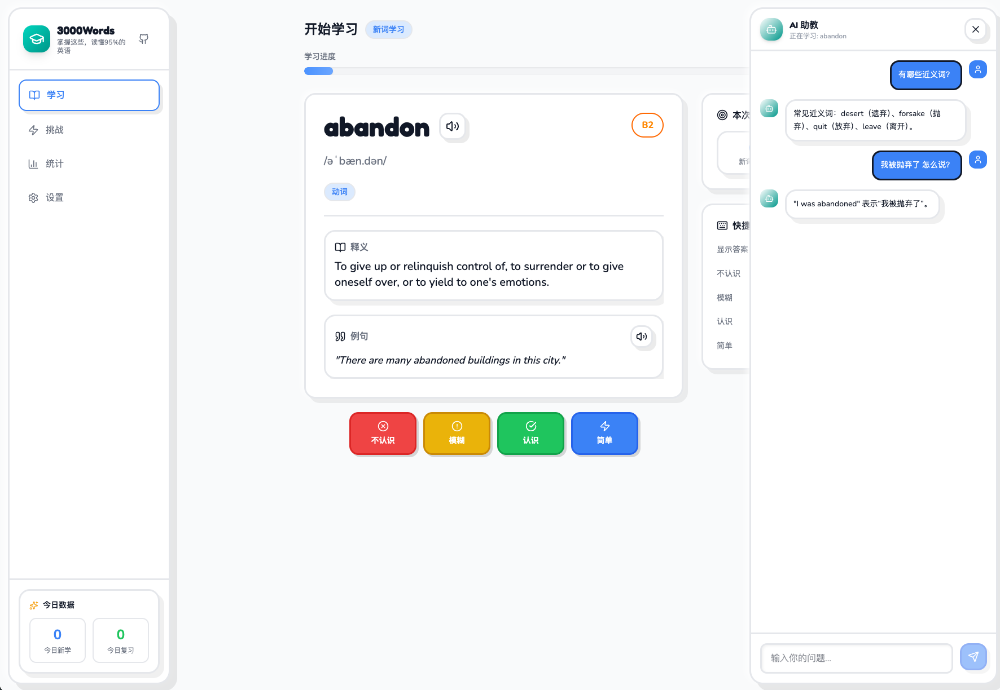

# 3000 Most Common English Words

A modern vocabulary learning application for mastering the 3000 most common English words, featuring spaced repetition, AI-powered tutoring, and a beautiful claymorphism design.



## Features

- **Spaced Repetition (SM-2)**: Scientifically proven algorithm to optimize your learning
- **AI Tutor**: Ask questions about any word with Cloudflare Workers AI
- **Text-to-Speech**: Native pronunciation powered by AI TTS
- **Multi-language Support**: Interface available in 10 languages (English, 中文, 日本語, 한국어, Español, Deutsch, Português, Русский, العربية, Bahasa Melayu)
- **Theme Options**: Light, Dark, and Eye Care (green) themes
- **Progress Tracking**: Visual statistics of your learning journey
- **Offline Ready**: All word data stored locally
- **Responsive Design**: Works on desktop and mobile

## Tech Stack

- **Frontend**: React 19 + TypeScript + Vite 7
- **Styling**: Tailwind CSS 4 with Claymorphism design
- **State Management**: Zustand
- **Routing**: React Router DOM
- **i18n**: react-i18next
- **Icons**: Lucide React
- **AI Backend**: Cloudflare Workers AI (GLM-4.7-flash + MeloTTS)

## Getting Started

### Prerequisites

- Node.js 18+
- npm or yarn

### Installation

```bash
# Clone the repository
git clone https://github.com/yourusername/3000MostCommonEnglishWords.git
cd 3000MostCommonEnglishWords

# Install dependencies
npm install

# Start development server
npm run dev
```

### Environment Variables

Create a `.env` file for AI features:

```env
VITE_AI_WORKER_URL=https://your-worker.workers.dev
```

### Cloudflare Worker Setup

To enable AI features (TTS and chat), deploy the Cloudflare Worker:

```bash
cd cloudflare-worker
npm install
npm run deploy
```

## Project Structure

```
├── src/
│   ├── components/     # UI components
│   ├── pages/          # Route pages (Learn, Stats, Settings)
│   ├── stores/         # Zustand state stores
│   ├── hooks/          # Custom React hooks
│   ├── algorithms/     # SM-2 spaced repetition
│   ├── i18n/           # Internationalization
│   ├── services/       # API services
│   └── types/          # TypeScript types
├── cloudflare-worker/  # AI backend (TTS + Chat)
├── public/             # Static assets
└── Screenshot/         # App screenshots
```

## Commands

```bash
npm run dev      # Start development server
npm run build    # Build for production
npm run preview  # Preview production build
npm run lint     # Run ESLint
```

## Design

The app uses **Claymorphism** design style featuring:
- Soft 3D appearance with playful aesthetics
- Thick borders and large border radius
- Double shadows for depth
- Pastel color palette

## License

Apache License 2.0
